<!-- _class: lower-heading -->

# Waffle :waffle:
Dean Keeble
CSG Meeting, 2nd February 2026

---

### What makes a _good_ PDF beamline? 
A good PDF measurement is usually characterised by accesing a large momentum transfer

---

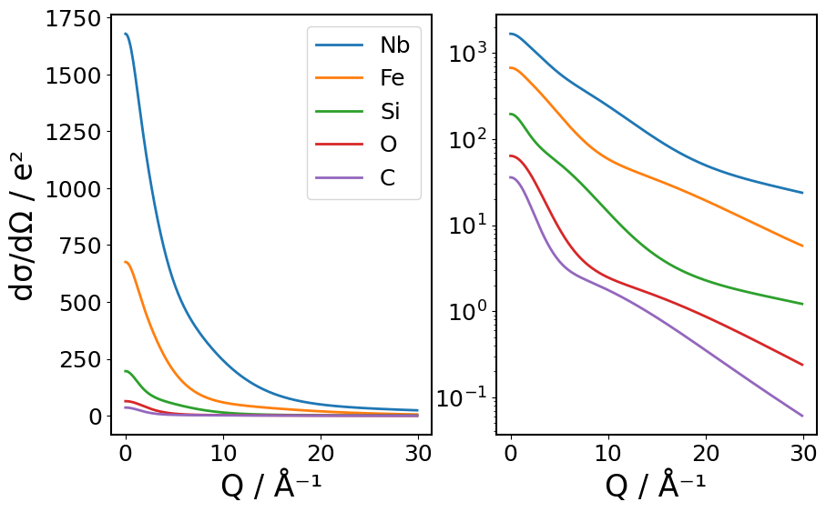

---

### What makes a _good_ PDF beamline? 
A good PDF measurement is usually characterised by accesing a large momentum transfer

$$\begin{aligned}Q = \frac{4\pi\sin(\theta)}{\lambda}
\end{aligned} $$
---

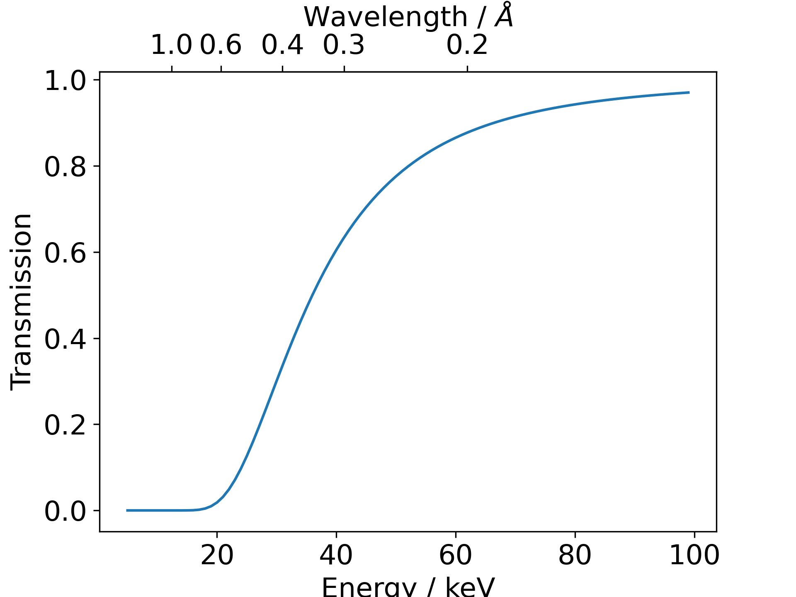

#### Small wavelengths have another advantage: they go through the sample better
---

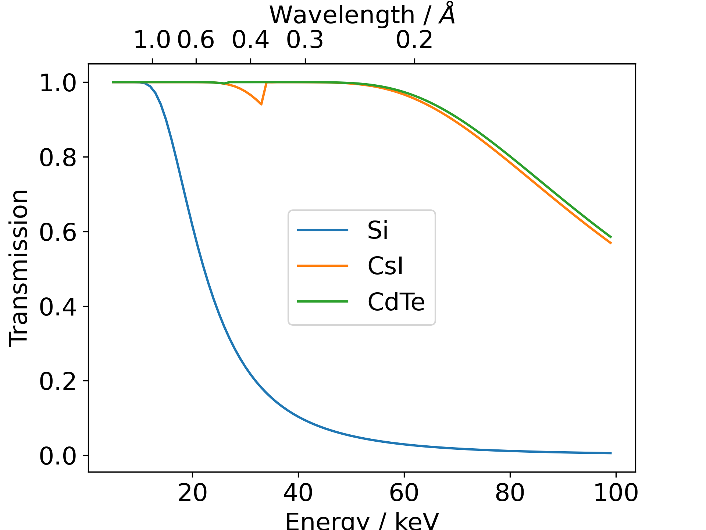
problem is if they go through the sample then they also go through the detector

---

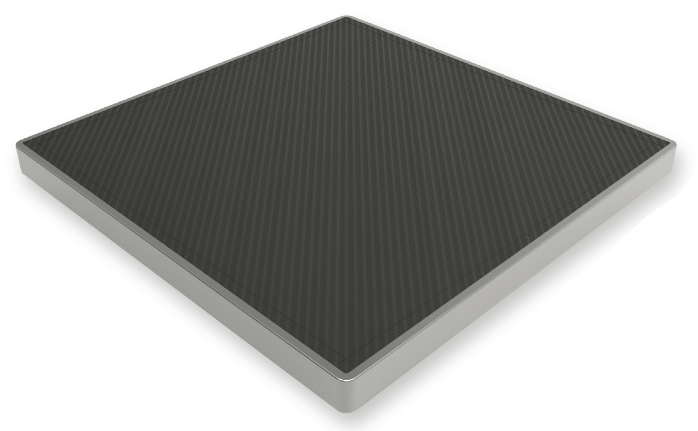

## Varex (_née_ Perkin Elmer) Detectors
&nbsp; &nbsp; &nbsp; &nbsp; &nbsp; &nbsp; &nbsp; &nbsp; &nbsp; &nbsp; &nbsp; &nbsp; &nbsp; &nbsp; &nbsp; &nbsp; &nbsp; &nbsp; &nbsp; &nbsp; &nbsp; &nbsp; &nbsp; &nbsp; &nbsp; &nbsp; :white_check_mark: big
&nbsp; &nbsp; &nbsp; &nbsp; &nbsp; &nbsp; &nbsp; &nbsp; &nbsp; &nbsp; &nbsp; &nbsp; &nbsp; &nbsp; &nbsp; &nbsp; &nbsp; &nbsp; &nbsp; &nbsp; &nbsp; &nbsp; &nbsp; &nbsp; &nbsp; &nbsp; :white_check_mark: heavy
&nbsp; &nbsp; &nbsp; &nbsp; &nbsp; &nbsp; &nbsp; &nbsp; &nbsp; &nbsp; &nbsp; &nbsp; &nbsp; &nbsp; &nbsp; &nbsp; &nbsp; &nbsp; &nbsp; &nbsp; &nbsp; &nbsp; &nbsp; &nbsp; &nbsp; &nbsp; :white_check_mark: cheap

---

## But... there are drawbacks
1. You're now wedded to high-energy photons
1. Have limited dynamic range
1. Have not fantastic resolution
2. Are susceptible to "burn-in" 

---
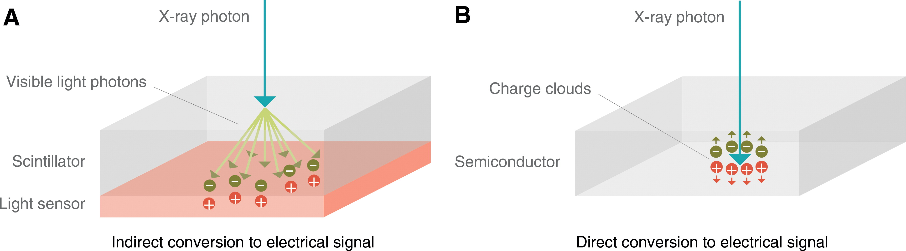
 <!-- _footer: https://doi.org/10.1148/radiol.2018172656--> 

---
On the 10th July 2018 the CEO signed a PPF for an ambitious angularly-resolved CdTe (ARC) hybrid photon counting detector

---

&nbsp;

$$\begin{aligned}
Q &= \frac{4\pi\sin(\theta)}{\lambda} \\
&= \frac{4\pi\sin(70)}{0.161669} \\
&\approx 73.0 \text{ Å}^{-1} \\
&\approx \textit{ludicrous}
\end{aligned} $$

---
### But... there are drawbacks
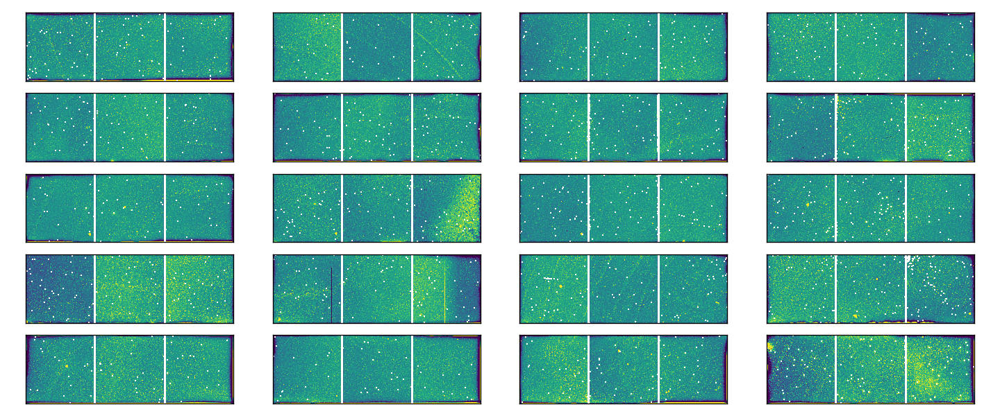

---
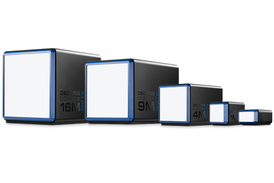

---

 &nbsp;| model | sensor  thickness | pixel size | frame rate |  coverage | width
:-----:|:------|:-----|:------|:------|:---|---
| ARC CdTe| 1000 um | 55 um | 25 Hz | 109° | 42.2 mm
 | Eiger2 X CdTe | 750 um | 75 um | 2.2 kHz | 17° | 38.4 mm

---

### Simulations of scattering from LaB6

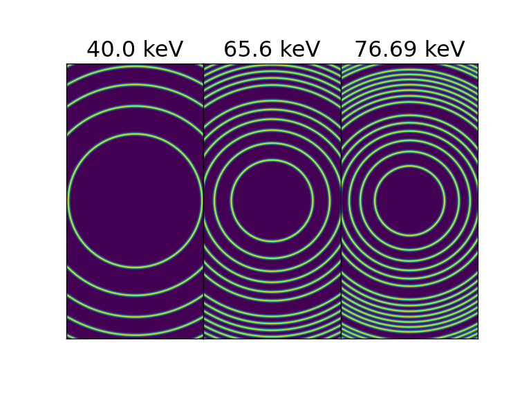

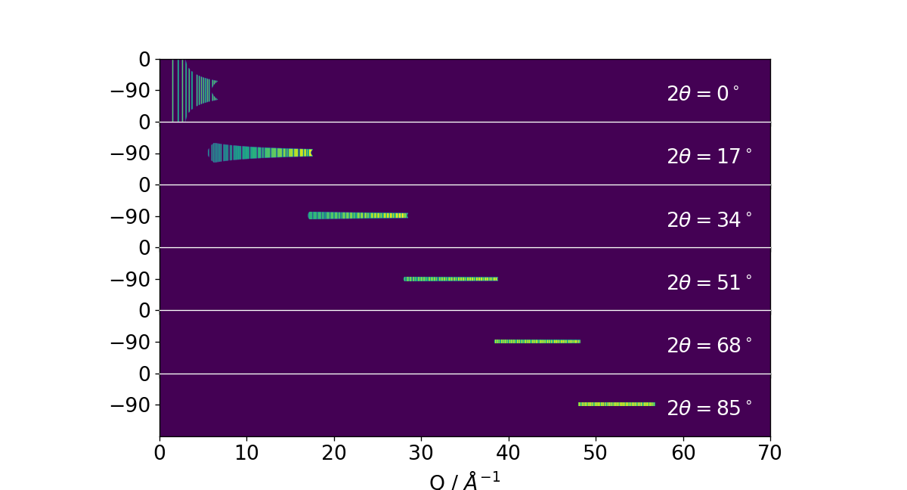

---

And that's why we ordered an Eiger?
... not entirely.

---
### Diamond-II WBS 1.3 - Core Software, Controls and Computing
- Hardware Infrastructure
- Software Infrastructure
- Data to Information
- Real-time Data
- Experiment Management
- Information Management

---

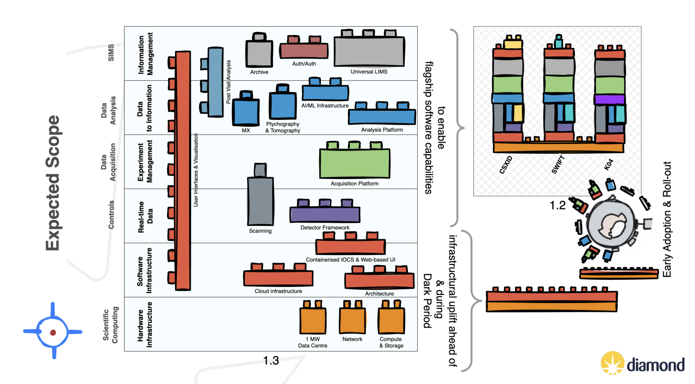

---
We'll be using the D-II software stack for Eiger collections
- bluesky, ophyd, ophyd-async, dodal
- sample, experiment definition services
- UIs, web interfaces
- containerised analysis platform

---

# Waffle &nbsp; &nbsp;&nbsp;&nbsp;&nbsp;&nbsp;&nbsp;&nbsp;&nbsp;&nbsp;&nbsp;&nbsp;&nbsp;&nbsp;&nbsp;&nbsp;&nbsp;&nbsp;&nbsp;&nbsp;&nbsp;&nbsp;&nbsp;&nbsp;&nbsp;

[ **wof**-uhl ]
**noun**
*In user interface design, "waffle" refers to a grid-like menu or app launcher, often used as a navigation element, resembling a waffle's squares.*

---

## New Possibilities / Conclusions? 
- March - June we'll be trying to build new scans
- Benefit to I15-1:
  - new detector
  - better metadata management
- Benefit to Diamond: 
  - prototype _how_ to put new software on existing beamline

---

## Acknowledgements / Project Team
&nbsp;
&nbsp;
i15-1 team 
scm-x controls & daq teams
ulims
analysis platform team
project management team
too many other people to mention! 

---
## Quiz time! 

---
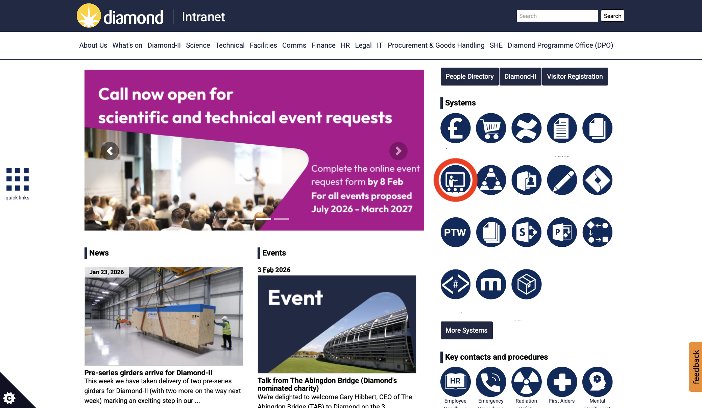

---

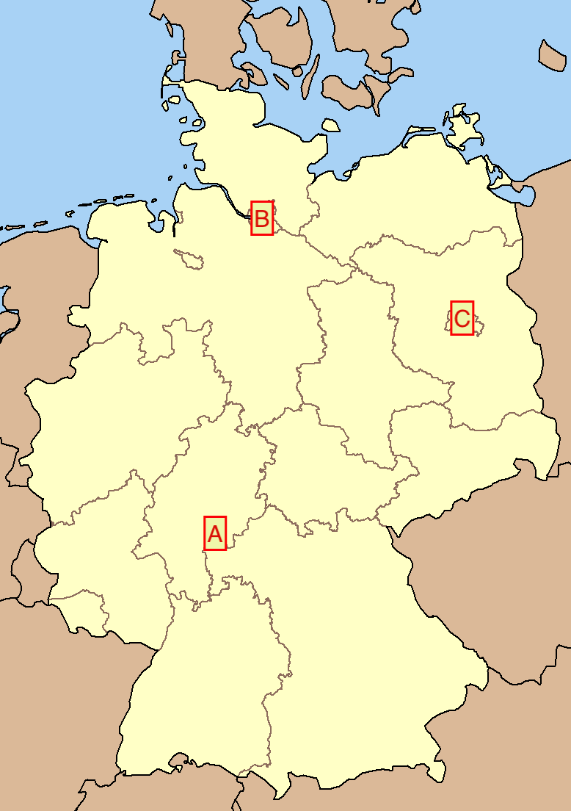

---

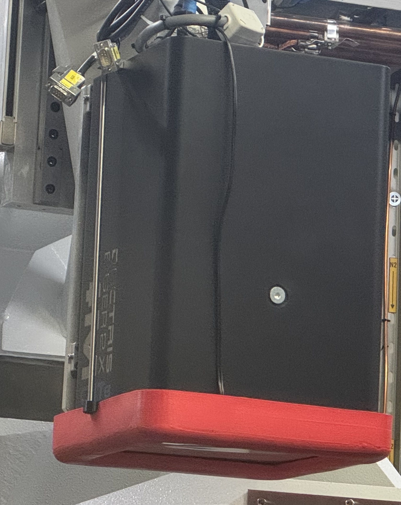

